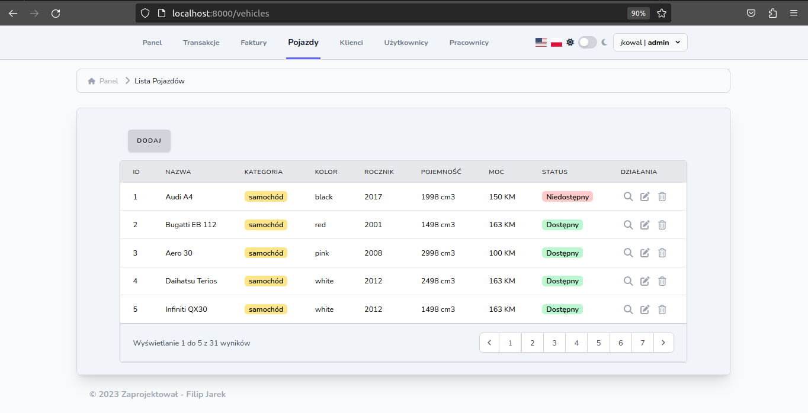
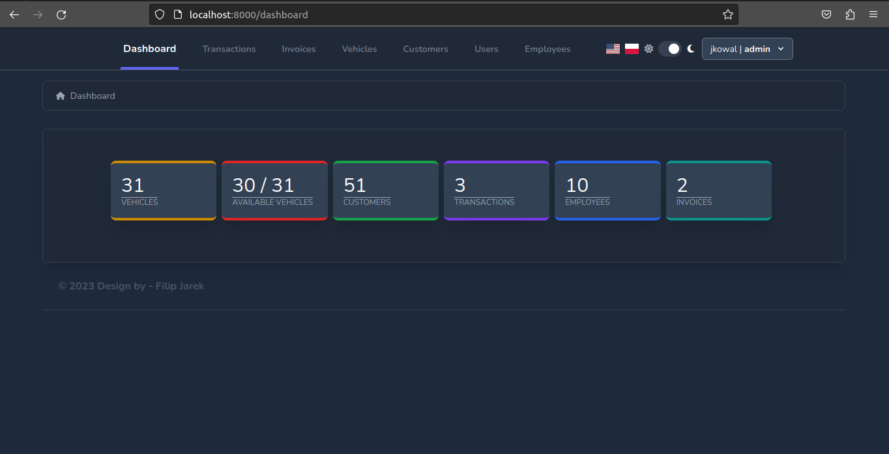
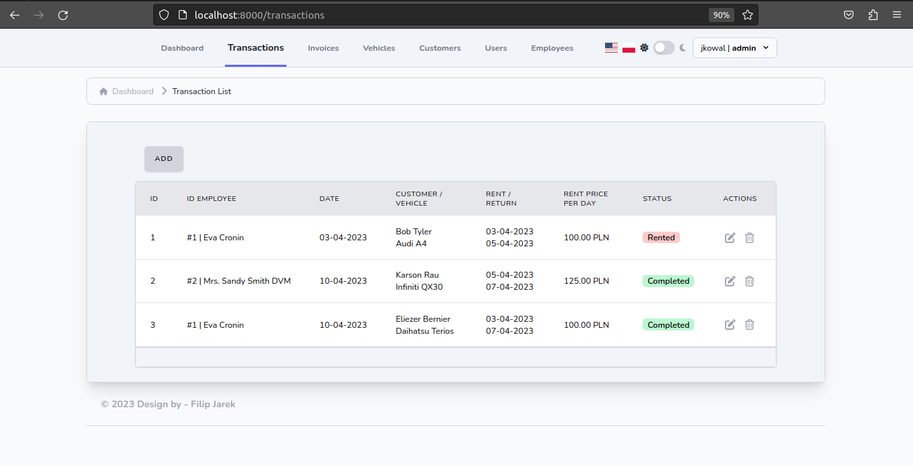
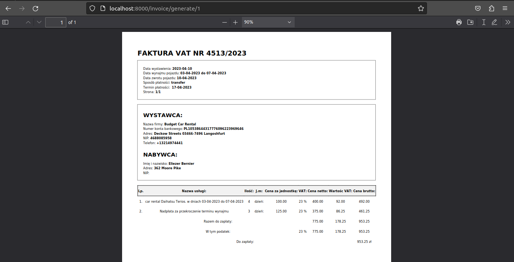
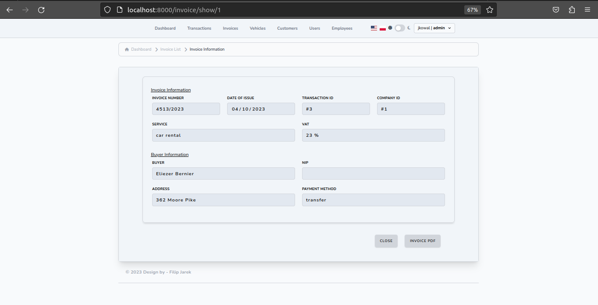
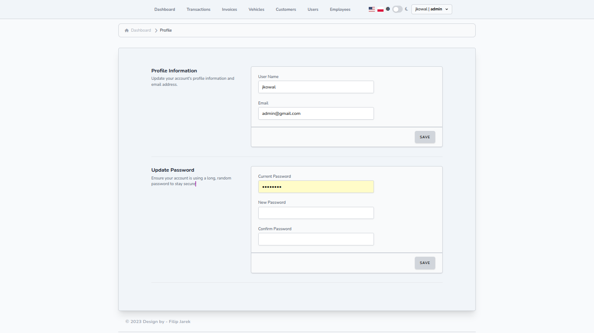

# Vehicle-rental
> A web application connected to a database was created for use in a car rental company. In order to improve the stages related to the rental of vehicles, to facilitate the collection and processing of information.

## Table of Contents
* [Technologies Used](#technologies-used)
* [Features](#features)
* [Screenshots](#screenshots)
* [Setup](#setup)

## Technologies Used
    
    Laravel 9.19
    PHP 8.0.2
    Node.js 18.8.0
    npm 8.18.0
    TailwindCSS 3.2.6
    Sweet-alert 5.1
    XAMPP 8.10
    Fakerphp/faker 1.21
    Phpunit/phpunit 9.6.6
    
    
## Features
List the ready features here:
- User login and registration
- Selection of displayed language (Polish/English)
- App theme selection (light/dark)
- Creating, editing and deleting: users, employees, customers, vehicles, invoices, transactions
- Rental and return of vehicles
- View the number of all vehicles and those available
- View the number of customers, transactions, employees and invoices
- Create and generate an invoice in PDF format
- Checking which user is available and when he was last logged in

## Screenshots
















## Setup
#### Step 1 : Clone the project
```
$ git clone https://github.com/filipjarek/vehicle-rental
```
#### Step 2 : Change current directory
```
$ cd vehicle-rental
```
#### Step 3 : Generate key
```
$ php artisan key:generate
```
#### Step 4 : Configuration
```
Copy .env.example file to .env on the root folder.
Set the database (mysql) in .env file db_name, db_username and db_password.
```
#### Step 5 : Install dependencies
```
$ composer install
$ npm install
$ npm run build
```
#### Step 6 : Setup database
```
$ php artisan migrate:fresh --seed
```
#### Step 7 : Run the project
```
$ php artisan serve
```
Open link in your browser: http://localhost:8000:

#### Admin credentails
```
email: admin@gmail.com
password: password
```
